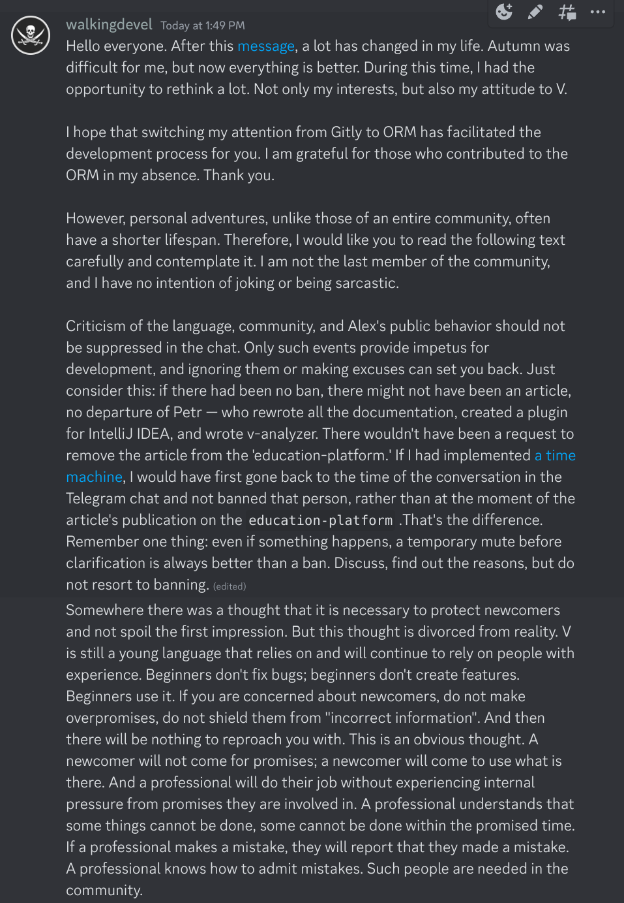
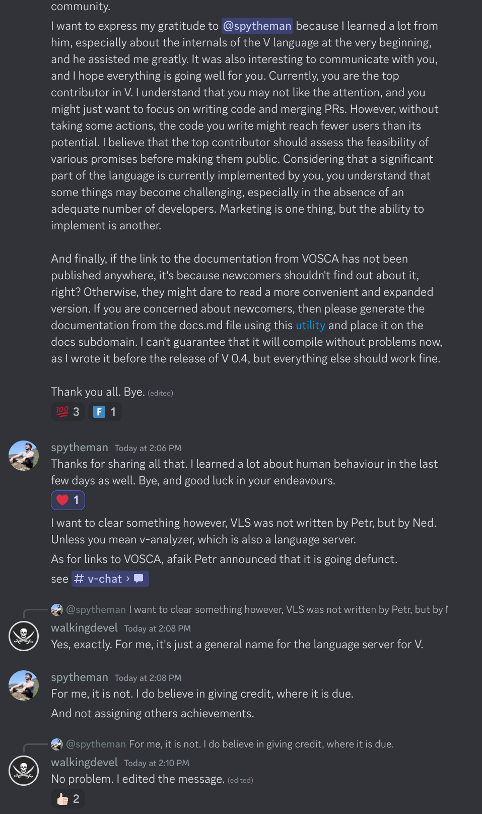
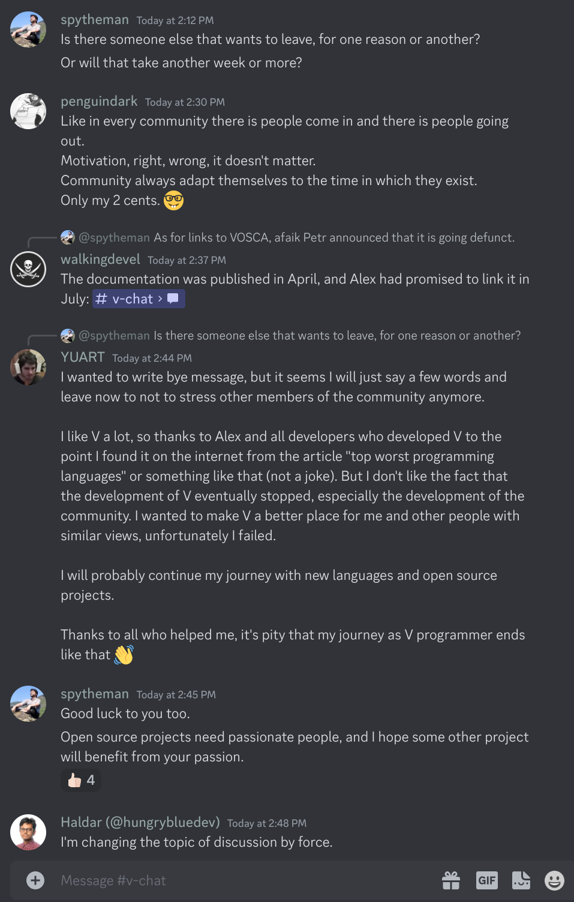

# Now this account is a tombstone on the V grave.

On November 25, I decided to bid farewell to the V community due to numerous changes in my life. Originally, my plan was to return and address the issues I had committed to resolving, allowing me to leave quietly without the weight of responsibility and technical debt. However, recent events involving bans and articles([#1](https://n-skvortsov-1997.github.io/reviews), [#2](https://asvln.com/rants/pathetic.html)) accelerated my departure. In light of these changes, I decided to leave sooner than initially intended. Before leaving, I wanted to express my farewell message to users of the official V Discord server and fellow developers.

But Alex, through his actions, confirmed everything that was written about him in [the article](https://n-skvortsov-1997.github.io/reviews/#about-the-v-community). As soon as he saw my message and the [YUART](https://github.com/ArtemkaKun) message, he deleted everything, including the replies to my message. Afterward, he expelled me from the GitHub organization (which is probably acceptable, but it's better not to do it right away, considering there are currently 52 people there, and almost all of them are already inactive in V).

I want you to read my and [YUART](https://github.com/ArtemkaKun)'s messages below and decide for yourself whether it was worth deleting them or if I simply hurt someone's ego.

Open-source development is not only about code but also about the ability to accept criticism. If you can't, then there's nothing for you to do here. Don't forget about private repositories, where you can make at least 100 promises every day, and no one will say anything to you about it.

Good luck to everyone.

---

Below are messages that have been deleted and you will no longer see them on the V Discord server:

Links:

https://n-skvortsov-1997.github.io/reviews

https://asvln.com/rants/pathetic.html
